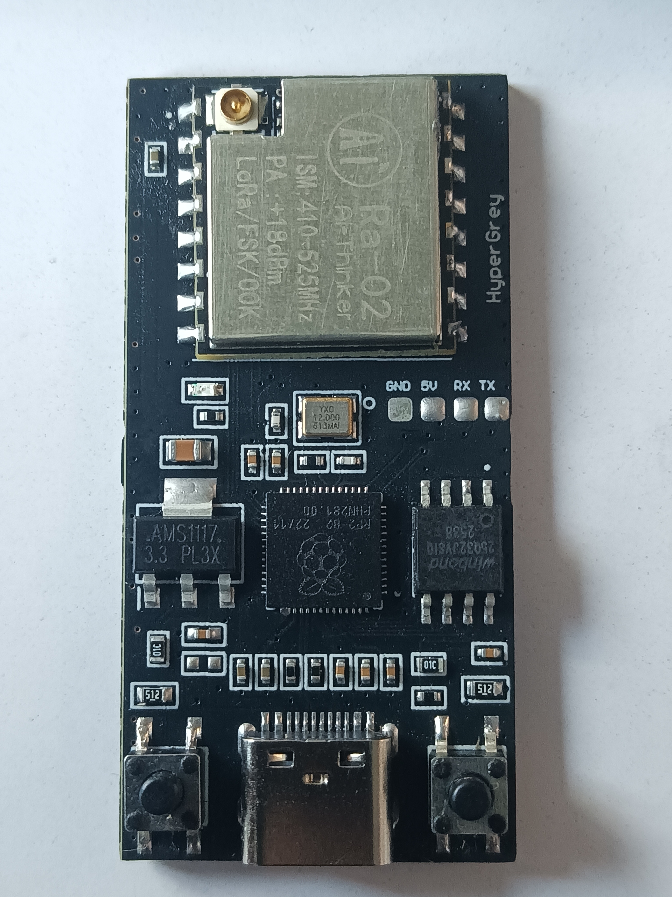
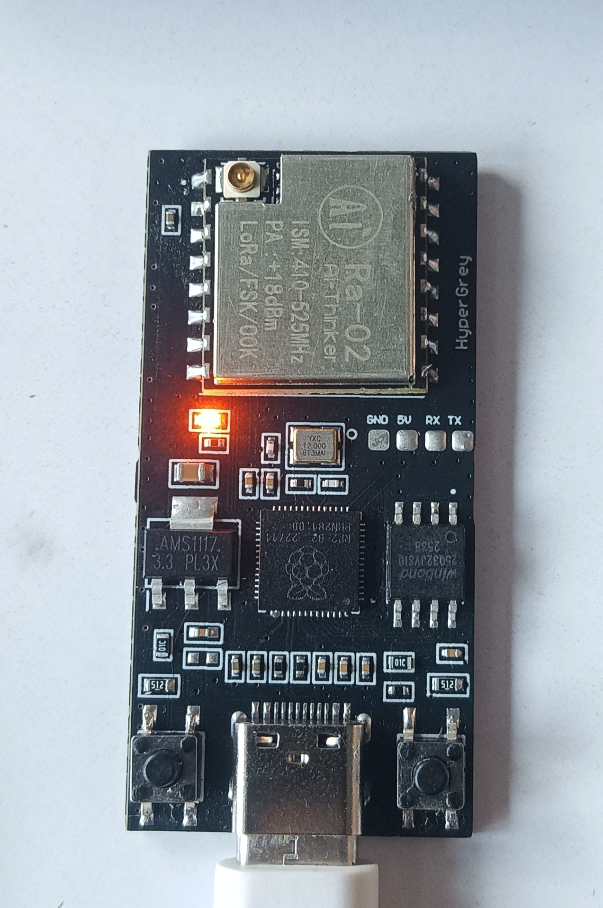

# Hypergrey

> USB-based LoRa terminal for long-distance transceiving.

Hypergrey is an open-hardware LoRa transceiver in a compact dongle/terminal form factor. Plug it directly into any host machine (PC, Raspberry Pi, SBC) via USB to send and receive serial data over long-range LoRa links without extra wiring or breakout boards.

---

## Highlights

- **Direct USB Interface:** Plug-and-play serial connection for any terminal or host software.
- **Long-Distance Transceiver:** Tuned Sub-GHz LoRa RF frontend for robust telemetry and remote messaging.
- **Compact & Portable:** Engineered as a single integrated stick/dongle.
- **Open Hardware:** Schematics, board layouts, and firmware are open for learning, modification, and reproduction.

---

## Visuals & Hardware Layout

### Hardware Build Overview

*Physical Hypergrey board prototype.*


*Close-up of the USB LoRa terminal module.*

---

## Hardware Specifications

| Spec | Detail |
| :--- | :--- |
| **Form Factor** | USB dongle / terminal |
| **Connectivity** | USB Type-C / USB-A |
| **RF Transceiver** | LoRa Sub-GHz (868 / 915 MHz / 433 MHz) |
| **Interface** | Virtual COM / Serial UART |
| **Antenna** | SMA / IPEX / PCB trace |
| **License** | Open Hardware (CERN-OHL / MIT) |

---

## Directory Structure

```
hypergrey/
├── images/       # Hardware photos, schematics, and diagrams
├── hardware/     # KiCad schematics, PCB layout, and gerbers
└── firmware/     # Source code and precompiled binaries
```

---

*Part of the [BeepBop](https://github.com/dwan6767/BeepBop) device chain.*
